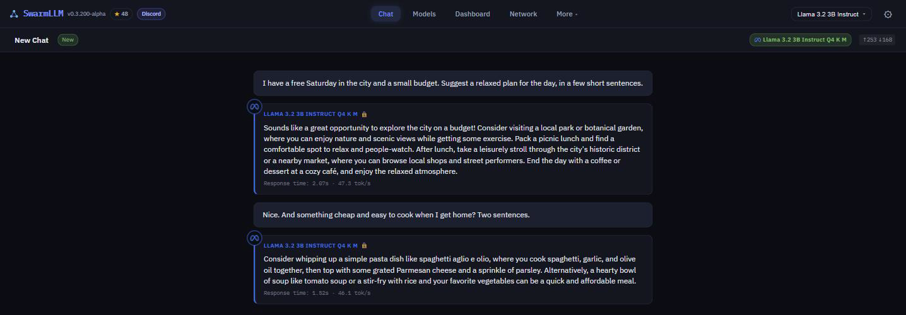
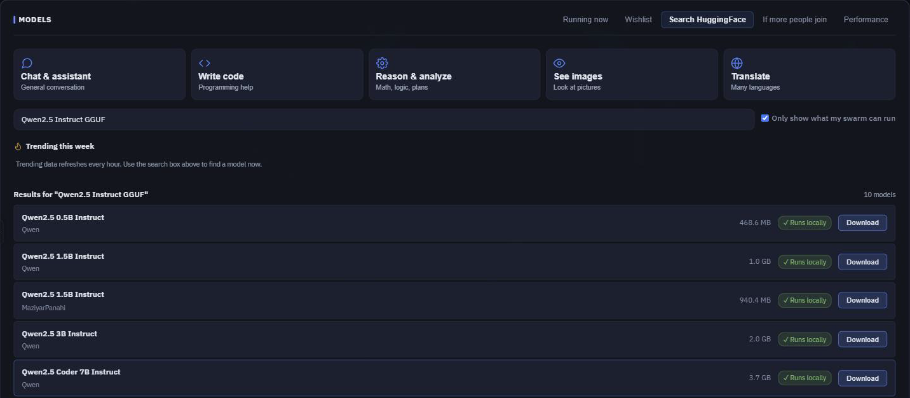
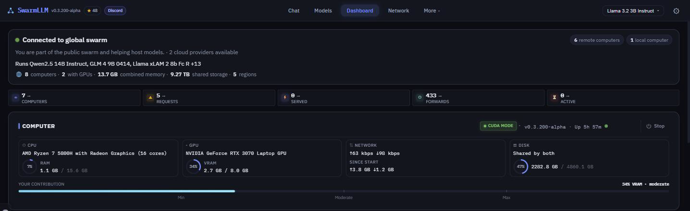
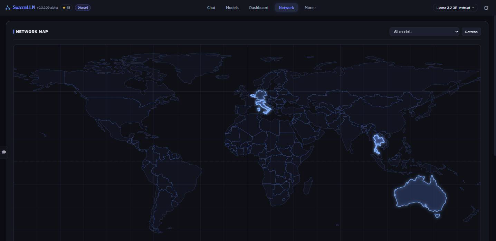

# SwarmLLM

[](https://github.com/enapt/SwarmLLM/releases)
[](https://discord.gg/nq9be3u828)
[](https://github.com/enapt/SwarmLLM/stargazers)
[](LICENSE-MIT)
[](https://github.com/enapt/SwarmLLM/actions/workflows/ci.yml)
[](https://www.rust-lang.org/)

## Run AI on your own computer. Run bigger AI together.

SwarmLLM is a free app that gives you a ChatGPT-style assistant running on
your own computer, using open AI models from Meta, Google, Alibaba, Mistral
and others. When a model is too big for one machine, computers running
SwarmLLM team up over the internet and run it together, each doing part of
the work.

**No account · No subscription · No ads · No crypto · Open source · Updates itself**

**Today the swarm runs medium-sized models. The goal is giant ones — free for
everyone.** Bigger AI models give noticeably smarter answers, but the biggest
open ones (70 billion "parameters" and up) need equipment normally found only
in data centres. A typical home computer can't hold one. Ten or so of them,
each holding a part, can — and every computer that joins brings that closer.

**[Download](#get-started)** · **[Join the Discord](https://discord.gg/nq9be3u828)** — find people near you to team up with · **[For developers](#for-developers)**



> **An early version, improving every week.** Fixes reach you automatically.
> Hit a rough edge? [Tell us](https://github.com/enapt/SwarmLLM/issues).

## Get started

Pick the download for your computer from the
[latest release page](https://github.com/enapt/SwarmLLM/releases/latest).

**Windows**

1. Download **`swarmllm-windows-x86_64-gpu.zip`** if your PC has a graphics
   card from NVIDIA, AMD or Intel — most gaming PCs do. No graphics card, or
   not sure? Take **`swarmllm-windows-x86_64-cpu.zip`**, which works on any PC.
2. Right-click the downloaded file and choose **Extract All**.
3. Open the extracted folder and double-click **`swarmllm.exe`**. Windows shows
   a blue box saying *"Windows protected your PC"* — it does that for programs
   from small projects that aren't registered with Microsoft yet. Click
   **More info**, then **Run anyway**.
4. A black window with scrolling text appears: that *is* SwarmLLM. **Leave it
   open** (minimising is fine) — closing it switches SwarmLLM off. The app
   opens in your web browser by itself.

**Mac** (with an Apple chip — M1 or newer)

1. Download **`swarmllm-macos-aarch64.tar.gz`** and double-click it to unpack.
2. Keep the folder in **Documents** or **Downloads** — not in Applications,
   where it can't update itself.
3. Double-click **`swarmllm`**. macOS blocks the first launch because the app
   isn't registered with Apple yet: open **System Settings → Privacy &
   Security**, click **Open Anyway**, and double-click it again.
4. A Terminal window opens — that's SwarmLLM running, so leave it open. The
   app appears in your web browser.

Macs with an Intel chip aren't supported yet.

**Linux** — download `swarmllm-linux-x86_64-cuda.tar.gz` if you have an NVIDIA
RTX 30-series card or newer, otherwise `swarmllm-linux-x86_64.tar.gz`, unpack
it and run `./swarmllm run`.

**Then pick a model and start chatting.** The app shows which models fit your
computer. Your first one is a one-time download of a few gigabytes — about the
size of a big game update. If the browser doesn't open by itself, type
`localhost:8800` into its address bar.



**And then leave it running, and tell someone near you.** While SwarmLLM is
open, your computer helps the swarm with what it can spare. Every computer
nearby makes bigger models faster for everyone in your area —
[here's why](#help-build-the-swarm).

<details>
<summary>Very old computer, Docker or Linux packages?</summary>

If SwarmLLM closes straight away with an *Illegal instruction* message, your
processor is from before 2013 — download the file ending in `-baseline`
instead. Docker images, `.deb`/`.rpm` packages (which run as a background
service and don't update themselves) and step-by-step help for every system
are in the
**[installation guide](https://enapt.github.io/SwarmLLM/getting-started/installation.html)**.

</details>

## What you can do with it

- **Chat with AI on your own computer.** Download a model once and it runs on
  your machine. Unlike a cloud chatbot, there's no company on the other end.
- **Use models too big for your computer.** Computers in the swarm each hold a
  part of a bigger model and work through your question together — fastest
  when they're close to each other, like your own laptop and desktop, or
  people in the same region.
- **Help others with what you can spare.** While SwarmLLM is open, your
  computer keeps parts of popular models and helps answer other people's
  questions — like seeding a torrent. There's no payment and no token; what
  you get back is the swarm itself: every model it can run, you can use.
- **Link your own devices.** Put your laptop, desktop and home server into one
  private group and use them as one bigger machine.
- **Plug it into the apps you already use.** Chat apps, coding assistants and
  AI agents that work with ChatGPT or Claude can use SwarmLLM instead —
  [see below](#for-developers).

The app comes in 21 languages, works on a phone, and shows which model gave
each answer and how long it took.



## How it works

An AI model is built from a stack of layers. SwarmLLM cuts a model into parts,
and each computer in a team holds a few of them. Your question is passed from
one computer to the next like a baton in a relay race — each does its share of
the work, and the answer comes back to you. (If you know BitTorrent: it's that
idea, applied to running AI instead of sharing files.)

```text
   your question ──▶ [ computer A ] ──▶ [ computer B ] ──▶ [ computer C ] ──▶ answer
                       parts 1–10         parts 11–20        parts 21–30
```

- **No central server.** Computers find each other on their own, even behind
  home routers.
- **Nobody has to download the whole model.** Each computer keeps only the
  parts it has room for, within limits you set — or every part, if the model
  fits and you want to run it yourself.
- **Every part is checked.** Model parts are verified when they arrive and
  every time they load, so a bad copy is caught and replaced.

## Help build the swarm

How big a model the swarm can run is set by who is online. A giant model needs
about ten ordinary computers' worth of spare room — and it only answers
quickly when those computers are **near each other**, because your question
passes through every one of them for every word of the reply. A team spread
across continents works, but slowly.

So the swarm needs two things: **more computers, and enough of them close
together.** No amount of code can do that part — only people can.



- **Install it, leave it running, and bring someone near you** — a friend
  across town, a housemate, your office. Your friend doesn't need to set
  anything up: they install it too, and the computers find each other.
- **[Find people near you on Discord](https://discord.gg/nq9be3u828)** and
  team up.
- **Star this page** so others can find it.

**Next up:** automatically forming teams from nearby computers — the step
that turns "enough people" into "fast giant models".

## Is it private?

It depends on where the model runs, so here's the straight answer:

- **On your own computer — yes.** When a model runs entirely on your machine,
  your conversation doesn't leave it.
- **In the public swarm — only partly.** Connections between computers are
  encrypted, so nobody watching the internet can read them. But the computers
  doing the work for you do see what they're working on, and a determined
  person running one of them could reconstruct your question. **Don't send
  anything sensitive through the public swarm.**
- **Start and finish on this computer — harder to read, still not private.**
  When your computer holds a model's first and last parts, it does the first
  and last steps itself (automatically; switch it per model on the model's card
  on the Dashboard). Other computers then never receive your typed text or the
  reply — only the numbers in between. Those numbers can still reveal much of
  what you wrote, so it is a real improvement but not a guarantee, and replies
  get slower.
- **Private Mode** keeps your questions on your own linked devices and, by
  default, on other SwarmLLM computers it treats as local: any on your network,
  or any that answer within 5 milliseconds. In a shared building or on a fast
  city network that can include strangers — `private_mode_allow_lan = false` in
  the config file turns that part off. Your computer still helps others with
  what it can spare. Switch Private Mode on under **More → My Devices** in the
  app.

The model list in the app shows which models are **on this computer**. The
details are in the
[security guide](https://enapt.github.io/SwarmLLM/architecture/security.html).

## Common questions

**What's the catch?** There's nothing to buy — no account, no ads, no
cryptocurrency. The only cost is your own electricity and internet while your
computer helps others. It's a community project: the app is free and open
source, and the computing power comes from people who leave it running.

**How is this different from Ollama or LM Studio?** They run AI on one
computer, and they're great at it. SwarmLLM does that too — and also lets
computers pool together, your own devices or the public swarm, to run models
one machine can't hold. ([How it compares with Petals, exo and
others](https://enapt.github.io/SwarmLLM/comparison.html).)

**What do I need?** A Windows, Linux or Apple-chip Mac computer, ideally with
8 GB of memory or more, and a few gigabytes of free disk space per model. A
graphics card makes it much faster but isn't required: on Windows most cards
work, on Linux it needs an NVIDIA RTX 30-series or newer. On a Mac it runs on
the main processor for now — slower than a PC with a gaming card, but a
MacBook Air can run the smaller models.

**Will it slow my computer down?** It can, while it's answering someone.
SwarmLLM keeps a slice of your graphics card free and fits around whatever
memory other programs are already using, but it doesn't know when you're
gaming or busy. If something feels slower, close the SwarmLLM window while
you play, pick a lighter contribution level in Settings, or set a
**Resource Schedule** so it holds back at the times you choose. It only runs
when you open it; it doesn't start with your computer.

**How much internet does it use?** A computer left running stays in touch with
the swarm all the time, and uses more while it shares model parts or answers
requests. Measured on 24 September 2026 on a computer running the current
release, idle and connected to six others: about **110 MB an hour received and
130 MB an hour sent** — roughly 5 to 6 GB a day if it runs all day. Most of that
is the swarm telling each other which models exist. That is still too much for
a capped or pay-per-gigabyte connection, and we are still bringing it down. You
can cap how fast it shares model parts in Settings, and it uses nothing while
it is closed.

**How much disk space?** SwarmLLM keeps what it stores within a disk limit —
50 GB by default — which you can change in Settings.

**Is it a virus?** No. Every line of the program is public for anyone to
inspect, and SwarmLLM's automatic updates only install releases signed by the
project. Windows and macOS warn you the first time only because the app isn't
registered with Microsoft or Apple yet — common for small free projects. Other
computers in the swarm can never run programs on yours: they only exchange
parts of AI models and the numbers the AI works with.

**How do I remove it?** Close the SwarmLLM window, then delete the folder you
unpacked and the folder where it keeps models: `%APPDATA%\swarmllm` on Windows,
`~/Library/Application Support/swarmllm` on a Mac, `~/.local/share/swarmllm`
on Linux.

**Which models can I run?** Popular open models — Llama, Qwen, Mistral, Gemma,
Phi, GLM and more. The app shows which ones your computer, or the swarm, can
actually run.

## For developers

*(You can skip this part if you just want to chat.)*

**A free OpenAI- and Anthropic-compatible endpoint on your own machine.** Point
any agent, coding assistant or chat UI at `http://localhost:8800` — no
per-token bill, and models bigger than your machine behind the same URL. Copy
your key from **Settings → Access Token** in the app:

```bash
export SWARMLLM_KEY=...   # from Settings → Access Token

curl http://localhost:8800/v1/chat/completions \
  -H "Authorization: Bearer $SWARMLLM_KEY" \
  -H "Content-Type: application/json" \
  -d '{"model": "llama-3.2-3b-instruct-q4-k-m",
       "messages": [{"role": "user", "content": "Hello!"}]}'
```

As a Claude Code backend:

```bash
ANTHROPIC_BASE_URL=http://localhost:8800 ANTHROPIC_AUTH_TOKEN="$SWARMLLM_KEY" \
  claude --model qwen2.5-coder-7b-instruct-q4-k-m
```

Also included: tool calling with local models, streaming, an MCP server, and
optional routing to 12 cloud providers with your own keys. Agents send long
prompts, so raise the context size first (`max_seq_len_override = 32768`
under `[inference]` in `config.toml`). That setting covers the parts of a model
your computer runs; a part running on another computer follows that computer's
own setting, and the swarm routes around one that is set too short.

- **[API reference](https://enapt.github.io/SwarmLLM/api/openai.html)** — OpenAI, Anthropic, Responses and MCP
- **[OpenClaw setup](integrations/openclaw/)** — a plugin that adds SwarmLLM to OpenClaw's setup wizard
- **[Configuration](https://enapt.github.io/SwarmLLM/configuration/reference.html)** and **[command line](https://enapt.github.io/SwarmLLM/configuration/cli-env.html)**
- **[Architecture](docs/ARCHITECTURE.md)**, **[performance](https://enapt.github.io/SwarmLLM/operations/performance.html)** and **[how it compares](https://enapt.github.io/SwarmLLM/comparison.html)**

To build it yourself:

```bash
# Requires Rust 1.90+
git clone https://github.com/enapt/SwarmLLM.git && cd SwarmLLM
cargo build --release
```

GPU builds and every feature flag are in [CONTRIBUTING.md](CONTRIBUTING.md).

## Get involved

- **[Discord](https://discord.gg/nq9be3u828)** — find people to team up with, ask questions, get help
- **[Issues](https://github.com/enapt/SwarmLLM/issues)** — bugs and feature requests (`swarmllm diagnostics` prints a report that's safe to paste)
- **[Discussions](https://github.com/enapt/SwarmLLM/discussions)** — ideas and questions
- **[Changelog](CHANGELOG.md)** — what changed recently
- **[Security](SECURITY.md)** — please report vulnerabilities privately
- **[Contributing](CONTRIBUTING.md)** — build, test and send a pull request

## Built in the open

SwarmLLM is built by a human developer working with Claude Code, an AI
programming assistant: the human sets the direction, tests and reviews, and
Claude writes the code. We say so openly so you can judge the project on its
merits. Every change is checked by thousands of automated tests
(2969 lib tests + 79 integration tests) before it ships, and regular
automated audits are logged in the repository. Scrutiny and contributions are
welcome.

## License

Dual-licensed under [MIT](LICENSE-MIT) and [Apache 2.0](LICENSE-APACHE).
